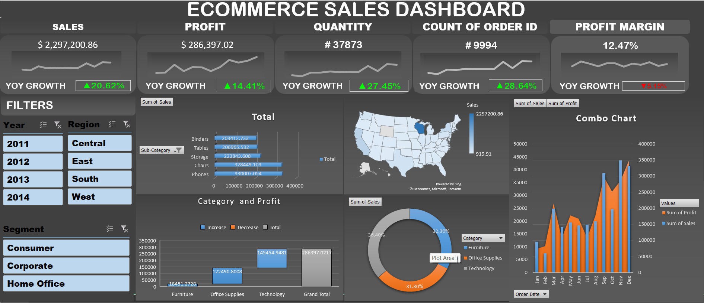

# 📊 Ecommerce Sales Analysis Dashboard

## Overview
This project is an interactive Excel dashboard built to analyze ecommerce sales performance.

## Tools Used
- Microsoft Excel
- Pivot Tables
- Pivot Charts
- Slicers
- Conditional Formatting
- Data Cleaning

## Dashboard Preview

## Key Metrics
- Total Sales
- Total Profit
- Total Orders
- Sales by Category
- Sales by Region
- Monthly Sales Trend

## Skills Demonstrated
- Data Cleaning
- Data Analysis
- Dashboard Design
- Pivot Tables
- Interactive Reporting

## Files
- Ecommerce Sales Analysis Dashboard project.xlsx
- dashboard.png

